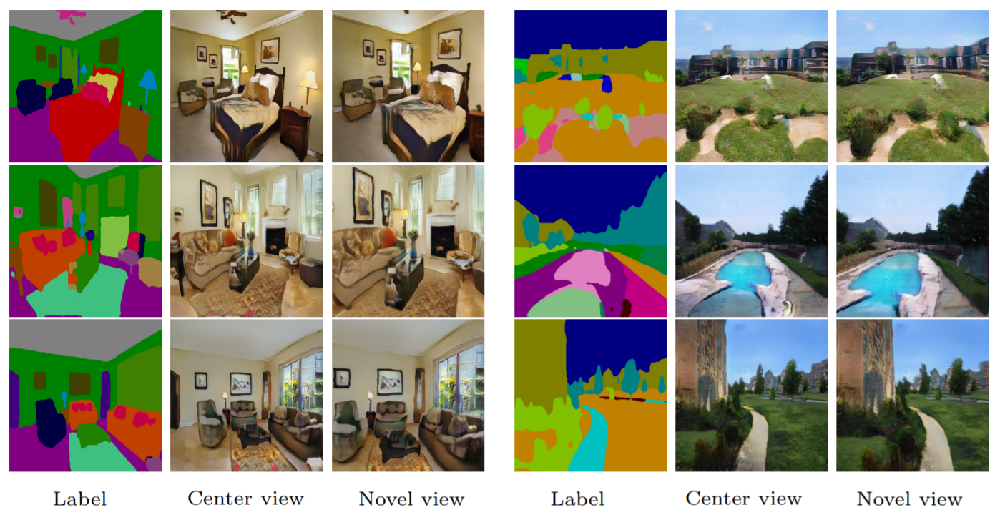

# [ECCV 2020] Semantic View Synthesis

### [[Paper](https://hhsinping.github.io/svs/link/paper.pdf)] [[Project Website](https://hhsinping.github.io/svs/)] [[Google Colab](https://colab.research.google.com/drive/1iT5PfK7zl1quAOwC227GfBjieFMVHjI5)]

<p align='center'>

</p>

We tackle a new problem of semantic view synthesis --- generating free-viewpoint rendering of a synthesized scene using a semantic label map as input. We build upon recent advances in semantic image synthesis and view synthesis for handling photographic image content generation and view extrapolation. Direct application of existing image/view synthesis methods, however, results in severe ghosting/blurry artifacts. To address the drawbacks, we propose a two-step approach. First, we focus on synthesizing the color and depth of the visible surface of the 3D scene. We then use the synthesized color and depth to impose explicit constraints on the multiple-plane image (MPI) representation prediction process. Our method produces sharp contents at the original view and geometrically consistent renderings across novel viewpoints. The experiments on numerous indoor and outdoor images show favorable results against several strong baselines and validate the effectiveness of our approach.
<br/>

**Semantic View Synthesis**
<br/>
[Hsin-Ping Huang](https://hhsinping.github.io/svs/), 
[Hung-Yu Tseng](https://sites.google.com/site/hytseng0509/), 
[Hsin-Ying Lee](http://vllab.ucmerced.edu/hylee/), and
[Jia-Bin Huang](https://filebox.ece.vt.edu/~jbhuang/)
<br/>
In European Conference on Computer Vision (ECCV), 2020.


## Quick start
```
conda create -n svs python=3.7
source activate svs
conda install pytorch==1.1.0
conda install torchvision==0.3.0
pip install scikit-image==0.15.0
pip install dill==0.2.9
pip install moviepy==1.0.1

git clone https://github.com/hhsinping/svs.git
cd svs
bash download_model.sh
# put your own semantic maps into labels folder OR run download_input.sh
bash test.sh
```

## Paper
```
@inproceedings{SVS,
  author       = "Huang, Hsin-Ping and Tseng, Hung-Yu and Lee, Hsin-Ying and Huang, Jia-Bin",
  title        = "Semantic View Synthesis",
  booktitle    = "European Conference on Computer Vision (ECCV)",
  year         = "2020"
}
```

## Acknowledgments
Our work builds upon
- [SPADE](https://github.com/NVlabs/SPADE)
- [RealEstate10K](https://google.github.io/realestate10k/)
- [Semantic Segmentation on MIT ADE20K](https://github.com/CSAILVision/semantic-segmentation-pytorch)
- [MiDaS](https://github.com/intel-isl/MiDaS)
- [DPSNet](https://github.com/sunghoonim/DPSNet)
